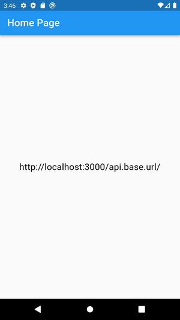

# Flutter My Template - Flutter 3 Project

My own template with step by step guideline for Flutter project (for flutter3), which helps me to create a new project and build Android app easily. (Go to 'Guidelines' section in this file).


_screenshot with (300 x 533) px_

### The latest update:

<ul>
    <li>1. First.</li>
    <li>2. Second.</li>
</ul>

### Features:

<ul>
    <li>1. First feature.</li>
    <li>2. Second feature.</li>
    <li>3. Third feature.</li>
</ul>

## Guidelines (How to use this template):

<small>Note: Skip this section for other project or repository.</small>

১. প্রথমে Terminal হতে Flutter Project Create করবো ‘--org’ ফ্ল্যাগ ব্যবহার করে।

```
flutter create --org com.alinsworld project_name
```

২. প্রজেক্ট Open করবো VS Code Editor এ এবং flutter_screenutil এবং flutter_dotenv ফ্লাটার প্যাকেজ ইনস্টল করবো।

<ul>
<li>flutter_screenutil: ^5.9.0 (https://pub.dev/packages/flutter_screenutil)</li>
<li>flutter_dotenv: ^5.1.0 (https://pub.dev/packages/flutter_dotenv)</li>
</ul>

৩. নিজের মত করে ফাইল ও ফোল্ডার সাজানো এবং ফাইল/ফোল্ডার পারমিশান দেয়া - <br />
**নিজের মত করে ফাইল ও ফোল্ডার সাজানো:** <br />
'generate_files_folders.dart' ফাইলটি Github প্রজেক্টটি থেকে কপি করে আমাদের প্রজেক্টে সরাসরি রাখবো এবং terminal এ গিয়ে রান করবো:

```
dart run generate_files_folders.dart
```

এতে করে আমার নিজের পছন্দ মত file এবং folder structure তৈরি হয়ে যাবে। চেক করলে দেখতে পাবো, প্রজেক্ট ফোল্ডার এ সরাসরি ‘assets’ ফোল্ডার, .env ফাইল এবং lib ফোল্ডার এর ভিতরে প্রয়োজনীয় সকল ফোল্ডার তৈরি হয়ে যাবে।

**ফাইল/ফোল্ডার পারমিশান দেয়া:** <br />
‘assets’ ফোল্ডার এবং '.env', '.env.dev' ফাইল একসেস করার জন্য পারমিশান দিতে হবে ‘pubspec.yaml’ ফাইল এ গিয়ে (গিটহাব প্রজেক্ট হতে pubspec.yaml ফাইলটি থেকে কপি করে বসাবো)। সবশেষে ফাইল save করবো এবং প্রয়োজনে flutter pub get কমান্ড প্রয়োগ করবো।

নোট: এই dart ফাইলটি কোন file এবং folder আগে থেকে থাকলে সেটাকে বা সেগুলোকে replace করবে না।

৪. '.gitignore' গিয়ে ‘.env’, ‘.env.dev’ দুইটি ফাইলকে যুক্ত করে দেবো যেন GitHub এ push না হয়। এছাড়াও key.properties এবং ‘key.jks’ দুইটিও যুক্ত করে রাখবো। <br />
(নোট: Github প্রজেক্ট হতে '.gitignore' ফাইল এ গিয়ে '# Manually added by me' এই অংশ থেকে শুরু করে একদম নিচ পর্যন্ত সবটুকু কপি করে আমাদের প্রজেক্ট এ বসাবো।)

Global variables এর জন্য তিনটি ফাইল প্রজেক্ট ফোল্ডারের ভিতরে সরাসরি রাখতে হয় - ‘.env’, ‘.env.dev’, ‘.env.example’ এবং pubspec.yaml ফাইলে গিয়ে config করতে হয় ‘.env’, ‘.env.dev’ এই দুইটি। এগুলোতে খুবই গুরুত্বপুর্ন তথ্য রাখা হয় যা public করা যাবে না।

<ul>
<li>‘.env’ - সকল গুরুত্বপুর্ন তথ্য থাকবে যা গিটহাব এ পুশ করবো না।</li>
<li>‘.env.dev’ - গুরুত্বপুর্ন তথ্য থাকবে যা লোকাল সার্ভারে টেস্ট করার জন্য। গিটহাব এ পুশ করবো না।</li>
<li>‘.env.example’ - একটা নমুনা ফাইল থাকবে যা '.env' এর মত কিন্তু কোন তথ্য থাকবে না। গিটহাব এ পুশ করা হবে।</li>
</ul>

৫. আমাদের local প্রজেক্ট এ গিয়ে main.dart ফাইল সকল কোড remove করে দেবো এবং Github প্রজেক্ট এ গিয়ে main.dart ফাইল এর সকল কোড কপি করে আমাদের লোকাল প্রজেক্ট এ paste করে দেবো। <br />
(responsiveness এর জন্য) main.art ফাইল এর design এর সাইজটা বলে দিতে হবে -

```
designSize: const Size(360, 690),
```

designSize - যে ডিজাইন দেখে কাজ করবো সেই ডিজাইন এর আর্টবোর্ড এর সাইজ অথবা যদি ডিজাইন না দেখে কাজ করা হয সেক্ষেত্রে যে ডিভাইসে টেস্ট করে কাজ করা হবে সেই ডিভাইস এর screen size হবে এখানে design size। <br />

যে কোন Size গুলো দিতে হবে এভাবে (responsiveness এর জন্য) - <br />
//for width

`width: 200.w`

//for height

`height: 500.h`

//for font size

`fontSize: 10.sp`

//for horizontal padding

`8.0.w`

//for vertical padding
`8.0.h`

//for ratio

`8.0.r`

৬. lib ফোল্ডার এর ভিতরে screens সাব ফোল্ডার পাবো সেখানে গিয়ে 'home_page.dart' নামক একটি স্টেটফুল অথবা স্টেটলেস ফাইল ক্রিয়েট করবো (see: home_page.dart for format)। main.dart ফাইল এ গিয়ে home_page.dart' ফাইলটি ইমপোর্ট করে দেবো। এবার নিজের মত করে home_page.dart ফাইল নিয়ে কাজ করবো। প্রয়োজনে home_page.dart ফাইল এর নাম পরিবর্তন করবো তবে এর জন্য main.dart এ গিয়েও সেটা ঠিক করে দিয়ে আসতে হবে।

lib ফোল্ডারটির ভিতরে - <br />
controllers - সকল ফাংশন। <br />
models - ডাটা মডেল। <br />
screens - সকল screens/pages থাকবে। <br />
widgets - সকল widgets যা সকল স্থান হতে একসেস করা যাবে। <br />
constant – এ্যাপ এ যে সকল color ব্যবহার করা হবে সেগুলো আর global variables যা .env তে রাখার প্রয়োজন নাই সেগুলো থাকবে।

আর assets ফোল্ডারে থাকবে - <br />
ডিজাইন করতে যে সকল images, icons, fonts ইত্যাদি প্রয়োজন হয়েছে আর data ফোল্ডার যদি offline database নিয়ে কাজ করা হয়। তবে এক্ষেত্রে খেয়াল রাখতে হবে যেন গুরুত্বপুর্ন তথ্য সেই ডাটাবেজ এ না থাকে যা পাবলিক করা যাবে না।

৭. Compile এবং Build করার জন্য - <br />
**App sign করতে হবে:** <br />
key.properties ফাইল আর key.jks ফাইল ব্যবহার করে Sign করতে হবে। আমার কাছে থাকা key.properties ফাইলটি কপি করে প্রজেক্ট ফোল্ডার এর 'android' সাবফোল্ডারটির ভিতরে রেখে দেবো। এতে সব সাজিয়ে রাখাই আছে। key.jks ফাইল কোথায় আছে সেটা বলে দেয়া আছে।

**build.gradle ফাইলটি config করতে হবে:** <br />
android/app/build.gradle ফাইল হতে minSdk, targetSdk, compileSdk ঠিক করে দিতে হবে।

**App information ঠিক করে দিতে হবে:** <br />
pubspec.yaml ফাইল হতে app information যেমন- app name, description এবং app version ঠিক করে দিতে হবে।

**AndroidManifest.xml এ গিয়ে কিছু permission দিতে হবে যদি প্রয়োজন হয়:** <br />
permission যেমন- internet permission, sms sending permission ইত্যাদি এর জন্য '\android\app\src\main\AndroidManifest.xml' ফাইল এ বলে দিতে হবে। নিচের মত করে লিখতে হবে -

```
<manifest xmlns:android ...>
<uses-permission android:name="android.permission.INTERNET" />
<uses-permission android:name="android.permission.ACCESS_NETWORK_STATE" />
    <application
```

নোট: manifest ট্যাগ এর পরে আর application ট্যাগ এর আগে uses-permission ট্যাগ ব্যবহার করে বলে দিতে হবে।

৮. এবার কাজ শুরু করতে হবে। এ্যাপ ডিবাগ করবো টারমিনাল এ ‌‌'flutter run' কমান্ড দিয়ে আর 'r' প্রেস করে 'hot reload' করবো, তাহলে কাজ কিছুটা হলেও দ্রুত হবে। সমস্যা হলে 'Shift+r' প্রেস করবো 'Hot Restart' এর জন্য।

৯. Launcher icon এবং Splash screen তৈরি করবো এ্যাপ এর জন্য: <br />
'\android\app\src\main\res' এখানে গিয়ে দেখতে পাবো 'mipmap-hdpi\ic_launcher.png' আইকনটি। আমাদের আইকনটি রেখে দেবো কিন্তু নামটি একই রাখবো তাহলে আর অতিরিক্ত config করতে হবে না। সব আইকন এর জন্যই একই কাজ করতে হবে। আর Splash screen এর জন্য 'flutter_native_splash: ^0.1.9' এই প্যাকেজটি ব্যবহার করতে পারি।

১০. সবশেষে build করবো: <br />
এ্যাপ চালু থাকলে ক্লোজ করতে হবে এবং এ্যাপ ক্লিন করে নিতে হবে এরপর নতুন করে রান করতে হবে। এবার build করতে হবে। <br />

**সকল platform এর জন্য বীল্ড করতে চাইলে** -

```
flutter build apk
```

**অথবা ভিন্ন ভিন্ন platform অনুযায়ী বীল্ড করতে চাইলে -**

```
flutter build apk --split-per-abi
```

key.properties ফাইল মুছে ফেলা: <br />
বীল্ড করার পর key.properties ফাইল সেখান হতে মুছে দিতে হবে অথবা সরিয়ে নিতে হবে।

(‘key.jks’ ফাইল প্রজেক্ট এ রাখা হয় না, না হলে সেটাও সরিয়ে নিতে হবে। -> .gitignore এ গিয়ে এই দুইটি ফাইল চেক করতে হবে যুক্ত করা আছে কিনা, না হলে যুক্ত করতে হবে। দেখতে হবে কোন confidential information such as login information with password, restricted api ইত্যাদি থাকলে সেগুলোও পুশ যেন না হয় সেদিকে খেয়াল রাখবো। আর প্রয়োজনে কি কি তথ্য ছিল ছিল তার একটা hints দিয়ে .env.example ফাইল এ লিখে রাখবো। এই ফাইলটি গিটহাব এ push হবে।)

**যে ধরনের Screen size এর ডিভাইস এ কাজ করবো এবং Test করবো:** <br />
কাজ করবো width 1080px এ কিন্তু test করবো একদম শেষে আরও দুইটি বা তিনটি ডিভাইসে যাদের resolution 1080px হতে কম আর বেশি।

**Distribution এর জন্য যা যা করার করতে হবে:** <br />
README.md ফাইল এ ছবিসহকারে সব কিছু গুছিয়ে লিখে রাখতে হবে যে লেখাগুলো পাবলিক হলে সমস্যা নাই। গিটহাব এর এই Template প্রজেক্ট এর README.md ফাইল ওপেন করে সকল কোড কপি করে নিয়ে আমাদের প্রজেক্ট ফোল্ডার এর README.md ফাইল এ গিয়ে paste করবো। এবার আমাদের প্রজেক্ট অনুযায়ী ফাইলটি পরিবর্তন করবো, সাজাবো।

**Screenshot নিতে হবে:** <br />
একটি screenshot নিতে হবে প্রজেক্ট রান করার পর যার নাম দেবো 'screenshot.png' এবং সাইজ হবে (300 x 533) px এবং সেটা প্রজেক্ট ফোল্ডার এর ভিতরে সরাসরি রাখতে হবে।

**flutter_logo.svg ফাইলটি নিতে হবে:** <br />
গিটহাব এর এই Template প্রজেক্ট এর 'flutter_logo.svg' ফাইলটি কপি করে আমাদের প্রজেক্ট এর ভিতরে সরাসরি রাখবো। ফাইলটি ReadMe.md ফাইল এ ব্যবহার করা হয়েছে।

**ReadMe.md ফাইল এর যেগুলো মুছে দিতে হবে:** <br />
আমাদের প্রজেক্ট এর ReadMe.md ফাইল এর 'Instruction' বিভাগ এর নিচে ছোট 'small' ট্যাগ এর লেখাগুলো মুছে দিতে হবে। এরপর 'Guidelines (How to use this template)' এই বিভাগটি সম্পুর্ন মুছে দিতে হবে। কারন এগুলো ছিল শুধুমাত্র Template প্রজেক্টটির জন্যই।

## Instruction:

This is a flutter project, so there should be whatever you need to run the flutter project. Then after clone the project should do what to do, (এটা একটি ফ্লাটার প্রজেক্ট, তাই ফ্লাটার প্রজেক্ট রান করতে যা কিছু প্রয়োজন সেগুলো থাকতে হবে। এরপর প্রজেক্টটি clone করার পর যা করতে হবে)

<ul>
    <li>1. creating .env and .env.dev files and also change information from .env and.env.dev (if need).</li>
    <li>2. flutter clean</li>
    <li>3. flutter pub get</li>
    <li>4. flutter run</li>
</ul>
<small>Note: These instructions are for all other flutter repositories which I want to clone but not for this repository. Because, I will not clone it, just create and build a new flutter project using it and following its guidelines. In here, I have to follow the 'Guidelines' section.</small>

### Extra Packages used:

<ul>
    <li>1. flutter_screenutil: ^5.9.0 - for responsie app design.</li>
    <li>2. flutter_dotenv - for global environment variables</li>
</ul>

### Problems (All that work is left):

There are some issues that have not been fixed. <br />
Such as: <br />

- 1.Sample problem

### Requires Android:

Minimum SDK Version: 21 (Android 5.0 or, Lollipop) and Target SDK Version: 34 (Android 14)

### Tested On:

- Emulator: Nexus_5X_API_29
- Real Device: Samsung Galaxy J7

### Used tools and programming languages:

- Flutter 3.13.2

### Project/App Version:

version: 1.2.1+2 (09-Dec-2023) <br />
<sub>(This information has been taken from 'pubspec.yaml' file.)</sub>

### Start Date:

03-Oct-2023

### Last Update:

09-Dec-2023

### App size:

00.00 MB (After build on APK for all platform) <br />
00.00 MB (After build on APK for specific platform)

### Developed by:

Md. Rezwan Saki Alin <br />
https://www.alinsworld.com/

### License:

Flutter is an open source framework by Google.

<p align="center"><a href="https://flutter.dev/" target="_blank"></a></p>
